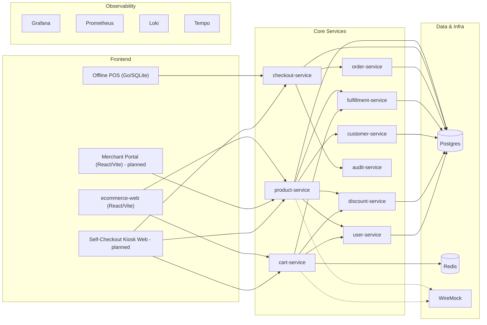
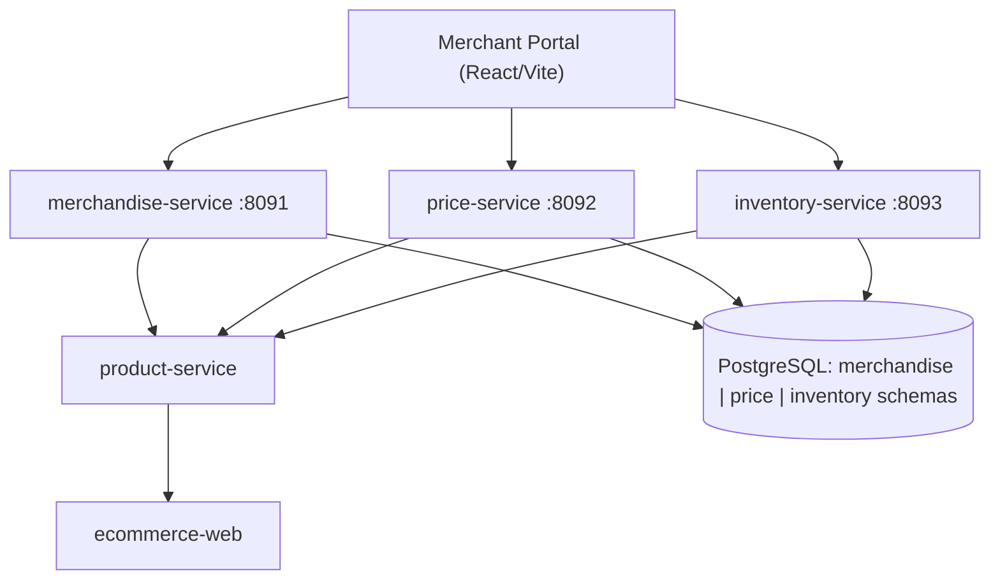
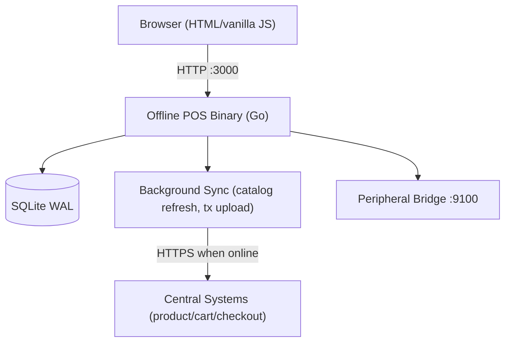
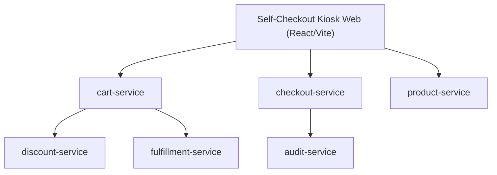
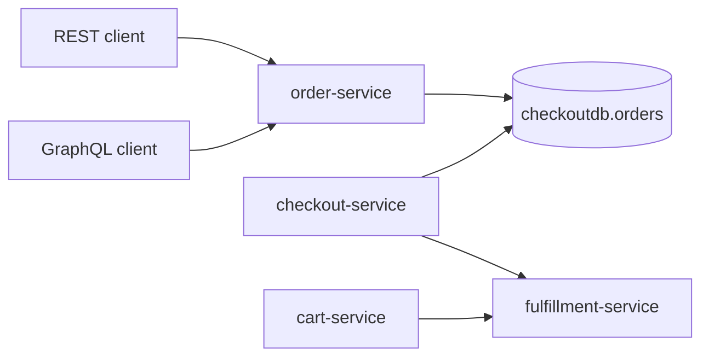

# Reactive Retail Platform (AI-Native Reference)

AI-native codebase experiment that uses a realistic, multi-service retail system to see how far agents can take you when building and operating production-grade software. Nx orchestrates a polyglot monorepo (Gradle backend today, TypeScript frontends coming) with platform libraries for logging, resilience, caching, and observability.

## What You Get
- Reactive Spring WebFlux services that propagate request metadata via Reactor Context (no MDC).
- Shared platform libs: structured logging, Resilience4j wrappers, Redis cache abstractions, global error handling, and test helpers.
- Nx-driven workflows (build, test, lint, graph) that span Gradle and npm projects.
- Observability stack pre-wired for JSON logs, metrics, and traces (Grafana, Prometheus, Loki, Tempo).
- Retail domain large enough to exercise checkout flows, promos, fulfillment, and audit while stress-testing AI workflows.

## Repository Map
- `apps/` — backend services such as `product-service`, `cart-service`, `customer-service`, `discount-service`, `fulfillment-service`, `audit-service`.
- `libs/backend/platform/` — shared platform libraries (`platform-logging`, `platform-resilience`, `platform-cache`, `platform-error`, etc.).
- `libs/frontend/` — shared UI/data/design packages for the upcoming React/Nx frontends.
- `docs/` — standards, ADRs, and implementation plans (`docs/plans/active` and `docs/plans/completed`).
- `tools/` — Nx workspace plugin and health checks (e.g., `tools/check-service-ports.mjs`, `tools/check-frontend.sh`).
- `e2e/` — mocked and full-stack journeys (Playwright/k6).

## Architecture Diagrams

**System overview (built today; merchant/data services + kiosk planned)**


**Product data services + merchant portal (planned)**


**Offline POS (disaster recovery)**


**Self-checkout kiosk web (planned)**


**Order + fulfillment flow**


## Documentation & Design Principles
- **Progressive disclosure:** Quickstart lives here; service- or feature-specific details live in app/library READMEs and plans; standards provide patterns when you need them.
- **Scoped guidance:** `AGENTS.md` files are nested—read the one nearest your path before editing to pick up local conventions.
- **Findability:** `CONTENTS.md` (repo map) and `docs/repo-explorer/` help you locate code/docs fast; `docs/index.md` routes to ADRs, standards, plans.
- **Consistency:** Templates in `docs/templates/` and standards in `docs/standards/` keep controllers, repositories, docs, and plans uniform across services and frontends.
- **Decision history:** ADRs in `docs/ADRs/` capture why; implementation plans in `docs/plans/active/` say how; completed plans are archived, never deleted.
- **AI-friendly:** Path aliases, shared types/hooks/components, and Nx project graph reduce guesswork for agents; strict lint/tests enforce boundaries early.

## Quick Start (Nx-First)
1. Install deps: `corepack enable && corepack prepare pnpm@9.15.0 --activate && pnpm install`
2. Build everything: `pnpm nx run-many -t build`
3. Test everything: `pnpm nx run-many -t test`
4. Build one module: `pnpm nx build :apps:product-service` (swap target as needed)
5. Run a service locally: `pnpm nx run :apps:product-service:bootRun` (Gradle fallback: `./gradlew :apps:product-service:bootRun`)
6. Docker stack (services + infra + observability):
   ```bash
   ./gradlew :apps:product-service:bootJar :apps:cart-service:bootJar :apps:customer-service:bootJar :apps:discount-service:bootJar :apps:fulfillment-service:bootJar :apps:audit-service:bootJar
   cd docker && docker compose up -d
   ```
   Then hit `http://localhost:8090/actuator/health` (or the service port) and check Grafana at `http://localhost:3000`.

## Development Modes
- Hybrid (recommended): `pnpm dev` to run Dockerized backends with local frontend HMR; or split into `pnpm dev:backend` / `pnpm dev:frontend`.
- Full Docker: `cd docker && docker compose up -d ecommerce-web`.
- Stop services: `pnpm stop`.

## Request Metadata Headers

| Metadata | Header | Format |
|----------|--------|--------|
| Store Number | `x-store-number` | Integer 1-2000 |
| Order Number | `x-order-number` | UUID |
| User ID | `x-userid` | 6 alphanumeric chars |
| Session ID | `x-sessionid` | UUID |

Headers are mandatory and flow through Reactor Context for logging, tracing, and downstream calls.

## Canonical Ports

| Service | Port | Notes |
|---------|------|-------|
| product-service | 8090 | Product aggregation |
| cart-service | 8081 (Docker) / 8082 (local) | Cart and checkout |
| customer-service | 8083 | Customer profiles |
| discount-service | 8084 | Discounts and promos |
| fulfillment-service | 8085 | Fulfillment orchestration |
| audit-service | 8086 | Audit/compliance |
| checkout-service | 8087 | Checkout and payment |
| order-service | 8088 | Order viewing/management |
| user-service | 8089 | User/auth service |
| wiremock | 8082 | Mock external services |
| Observability | 3000 (Grafana), 9090 (Prometheus), 3100 (Loki), 3200 (Tempo) | |

Run `node tools/check-service-ports.mjs` to validate new services.

## AI-Native Workflow Hints
- Always read scoped `AGENTS.md` files before editing; instructions nest by directory.
- Use Nx to inspect and operate the graph: `pnpm nx show projects`, `pnpm nx graph`.
- Keep implementation plans up to date in `docs/plans/active`; archive completed plans to `docs/plans/completed`.
- Prefer Reactor Context over MDC; follow Resilience4j decorator order (timeout → circuit breaker → retry → bulkhead).
- Frontend linting is strict (`pnpm lint:all`, `./tools/check-frontend.sh`); fix issues before PRs.

## Learn More
- Agent/developer guide: `AGENTS.md`
- Repository map: `CONTENTS.md`
- Standards: `docs/standards/` (backend, frontend, documentation)
- ADRs: `docs/ADRs/` (e.g., `006_frontend_monorepo_strategy.md`)
