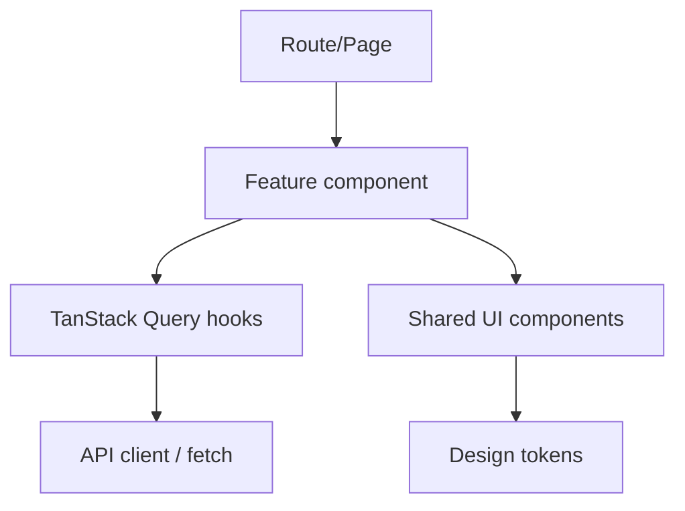

# Codex Understanding: `reactive-platform` (a.k.a. `reactive-test`)

This document captures my current “whole-repo” mental model after starting with `docs/` (standards, ADRs, plans) and then tracing the actual implementation (Gradle/Nx config, Docker Compose, apps, libs, tools, and tests).

It’s a **polyglot Nx monorepo**:

- **Backend**: Spring Boot 4 / WebFlux (reactive) + R2DBC Postgres + reactive Redis
- **Frontend**: React + Vite + TanStack Router/Query + shared UI/design tokens
- **Edge/Tools**: Go binaries (offline POS + peripheral emulator), Node tooling (Nx/workspace plugin, lint guardrails, docs generators)
- **Infra**: Docker Compose includes Redis, Postgres, WireMock, and Grafana/Prometheus/Loki/Tempo

---

## 1) How the Repository Is Intended to Be Used

### Documentation “system”

The repository treats documentation as a first-class system:

- **Standards** (`docs/standards/`): “how we do things” (backend + frontend patterns).
- **ADRs** (`docs/ADRs/`): “why we decided this”.
- **Plans** (`docs/plans/active/` + `docs/plans/completed/`): “how we implemented / will implement this”.
- **Generated repo explorer** (`docs/repo-explorer/`): browsable READMEs/AGENTS/CONTENTS from code (built by scripts in `tools/docs-explorer/` and used by `pnpm docs:*` scripts).

### Build/run orchestration

Nx is the top-level orchestrator:

- `@nx/gradle` discovers Gradle modules and exposes Gradle tasks as Nx targets.
- `@nx/vite`, `@nx/vitest`, `@nx/playwright`, `@nx/eslint` infer common targets for TS apps/libs.
- Gradle `buildSrc` convention plugins enforce Java toolchain and shared build rules.

---

## 2) Architecture

### 2.1 Workspace / Build Architecture

**Key idea**: Nx is the “task router and cache”; Gradle remains the “Java build engine”; Vite/Vitest/Playwright remain the “web build/test engines”.

```mermaid
flowchart TB
  dev[Developer / CI] --> nx[Nx CLI]

  nx -->|@nx/gradle| gradle[Gradle multi-project build]
  nx -->|@nx/vite| vite[Vite build/serve]
  nx -->|@nx/vitest| vitest[Vitest tests]
  nx -->|@nx/playwright| pw[Playwright e2e]
  nx -->|@nx/eslint + custom rules| eslint[ESLint/Stylelint/Guardrails]

  gradle --> buildSrc[buildSrc convention plugins]
  buildSrc --> java25[Java Toolchain 25]

  nx --> cache[Nx cache (local/CI)]
```

**Gradle conventions**:

- `buildSrc/src/main/kotlin/platform.java-conventions.gradle.kts` pins **Java 25 toolchain**, adds Spotless, and defines `archTest`, `lint`, `format`, `format-check`.
- `platform.application-conventions` applies Spring Boot conventions (bootable jars).
- `platform.library-conventions` applies Java library conventions (regular jars).

### 2.2 Runtime System Architecture (Services + Infra)

In Docker, the system is a set of services + infra:

- **Infra**: `redis`, `postgres`, `wiremock`, and observability stack (`tempo`, `loki`, `prometheus`, `grafana`, `promtail`).
- **Backend services**:
  - `product-service` (aggregation + search)
  - `cart-service` (REST + GraphQL + SSE subscriptions)
  - `checkout-service` (checkout orchestration + event publishing)
  - `order-service` (order read/update API; currently backed by checkout DB)
  - `user-service` (dev token endpoint + OIDC discovery + JWKS; also persists users)
  - `customer-service`, `discount-service`, `fulfillment-service`, `audit-service`
  - `merchandise-service`, `price-service`, `inventory-service` (merchant/data services)
- **Frontends**: `ecommerce-web` (nginx-served build), `merchant-portal` (nginx-served build)
- **Go apps**: `offline-pos` (single binary, SQLite), `peripheral-emulator` (WS/STOMP + dashboard)

```mermaid
graph LR
  subgraph Frontends
    eco[ecommerce-web]
    mp[merchant-portal]
    ops[offline-pos (Go)]
  end

  subgraph Backend
    ps[product-service]
    cs[cart-service]
    chs[checkout-service]
    os[order-service]
    us[user-service]
    cust[customer-service]
    disc[discount-service]
    fulf[fulfillment-service]
    aud[audit-service]
    merch[merchandise-service]
    price[price-service]
    inv[inventory-service]
  end

  subgraph Infra
    pg[(Postgres: cartdb, checkoutdb, userdb, ...)]
    r[(Redis: cache + pubsub + streams)]
    wm[WireMock (mocks + fake oauth)]
  end

  subgraph Observability
    tempo[Tempo]
    loki[Loki]
    prom[Prometheus]
    graf[Grafana]
  end

  eco --> ps
  eco --> cs
  eco --> us
  mp --> merch
  mp --> price
  mp --> inv
  mp --> us

  ps --> merch
  ps --> price
  ps --> inv
  ps --> r
  ps --> wm

  cs --> pg
  cs --> r
  cs --> ps
  cs --> cust
  cs --> disc
  cs --> fulf

  chs --> cs
  chs --> disc
  chs --> fulf
  chs --> pg
  chs --> r
  chs -->|CloudEvents via Redis Streams| r

  os --> pg
  us --> pg
  merch --> pg
  price --> pg
  inv --> pg
  cust --> pg
  aud --> pg
  aud --> r

  ps -.OTEL.-> tempo
  cs -.OTEL.-> tempo
  chs -.OTEL.-> tempo
  os -.OTEL.-> tempo
  us -.OTEL.-> tempo
  merch -.OTEL.-> tempo
  price -.OTEL.-> tempo
  inv -.OTEL.-> tempo
  aud -.OTEL.-> tempo
  prom --> graf
  loki --> graf
  tempo --> graf
```

### 2.3 Data Architecture

**Postgres** is used for durable state, and is split into multiple service-owned databases in Docker:

- `cartdb`, `checkoutdb`, `userdb`, `customerdb`, `audit`, `merchandisedb`, `pricedb`, `inventorydb` (created in `docker/postgres/init-databases.sql`).

**Redis** is used for:

- **Caching** (e.g., product-service read cache)
- **Pub/Sub** (cart-service GraphQL subscriptions fan-out)
- **Streams** (CloudEvents publish/consume pattern; checkout publishes `orders:completed`, audit consumes `audit-events`)

### 2.4 Observability Architecture

The system is wired for:

- **Traces**: OpenTelemetry → Tempo (OTLP gRPC) (service env vars in `docker/docker-compose.yml`)
- **Logs**: services write to a shared volume (e.g., `/app/logs`), promtail ships to Loki
- **Metrics**: Prometheus scrapes; Grafana provides dashboards

### 2.5 Application Code Architecture (Backend)

The “standard” layering is:

```mermaid
flowchart LR
  controller[Controller (REST/GraphQL boundary)] --> validation[Validation]
  controller --> service[Service (orchestration)]
  service --> repo[Repository/Client (I/O boundary)]
  repo --> downstream[HTTP/Redis/Postgres]
  controller --> ctx[Reactor Context: RequestMetadata]
  ctx --> logging[StructuredLogger/WebClientLoggingFilter]
```

Cross-cutting concerns are centralized in platform libraries under `libs/backend/platform/`:

- `platform-webflux`: `RequestMetadata` + `ContextKeys` for Reactor Context propagation
- `platform-logging`: `StructuredLogger` + `WebClientLoggingFilter` + log data models
- `platform-resilience`: `ReactiveResilience` applies timeout → circuit breaker → retry → bulkhead
- `platform-cache`: `ReactiveCacheService` + `RedisCacheService` with “fail silently” behavior
- `platform-error`: `GlobalErrorHandler` maps exceptions → structured error responses
- `platform-events`: CloudEvents + Redis Streams publisher/consumer base
- `platform-test`: shared test utilities + ArchUnit-style architecture enforcement hooks

### 2.6 Application Code Architecture (Frontend)

Frontend standards emphasize:

- **Feature folder structure** (`src/features/{domain}/...`)
- **Layering**: Route/Page → Feature (smart) → UI component (presentational)
- **TanStack Router + TanStack Query** (URL is state; server state handled centrally)
- **Shared libs** for UI, design tokens, API client, peripheral SDK
- **Hard enforcement** via module boundaries and custom ESLint/Stylelint rules



---

## 3) Guiding Principles (as expressed by docs + code)

### Reactive-first backend

- Prefer non-blocking stacks (WebFlux, R2DBC, reactive Redis).
- Avoid MDC; use Reactor Context (`RequestMetadata`) for correlation.
- Compose resilience at the I/O boundary with a consistent decorator order (timeout → circuit breaker → retry → bulkhead).
- Prefer “degrade gracefully” patterns (fallbacks, cache-aside, fallback-only).

### Consistency and standardization

- Service architectures converge on the same layering and naming.
- Cross-cutting behavior lives in shared platform libraries.
- Strong “guardrails” culture: architecture tests, lint rules, format rules, and predictable folder structures.

### Docs as source of truth (in intent)

- ADRs capture decisions; standards capture patterns; plans capture implementation.
- Auto-generated doc navigation (`docs/repo-explorer/`) is meant to keep docs discoverable.

### DX and scale via Nx

- Nx is intended as the unified interface across Gradle + Node + Go projects.
- Module boundaries are enforced across TS projects (scope/type tags).

### Test pyramid + realism

- Fast mocked E2E (MSW) for PRs.
- Full-stack E2E with Docker for main/nightly.
- k6 load/chaos tests to validate resilience behavior.

---

## 4) What Contradicts / Drifts (Docs vs Plans vs Implementation)

This repo is unusually well-documented, but there is meaningful drift between “what the docs say” and “what exists now”.

### Environment / tooling contradictions

- **Node version mismatch**: repo expects **Node 24.x** (e.g., `.node-version`, `.nvmrc`, `package.json#engines`), but the current runtime here is Node **v25.2.1**, which blocks `pnpm` entirely (`ERR_PNPM_UNSUPPORTED_ENGINE`). This prevents running Nx via pnpm in environments that aren’t pinned to Node 24.

### Documentation drift (multiple sources of truth)

- Canonical “where are things / how do I run things” information is spread across multiple docs (`README.md`, `AGENTS.md`, `docker/docker-compose.md`, `docs/*`). This is workable, but it requires keeping pointers up to date.
- For ports specifically, the canonical map is `tools/expected-ports.json` and the enforcement script is `node tools/check-service-ports.mjs`.

### ADR status vs implementation

- ADR `docs/ADRs/002_write_data_store.md` is **Status: proposed**, but the implementation already uses Postgres (R2DBC + Flyway) as cart-service persistence. This is a classic “decision became real but ADR status didn’t get updated”.

### Standards vs implementation differences

- Backend standards include example APIs that don’t exactly match the current platform libs:
  - `ReactiveCacheService` standard describes a `get(key, loader)` shape; the implementation is `get(key, Class<T>)` + explicit `switchIfEmpty(...)`.
  - Error handling standard describes a WebFlux `ErrorWebExceptionHandler` style; the platform error library uses `@RestControllerAdvice`.
  - Logging standard shows `RequestMetadata.fromHeaders(...)`; implementations largely construct `RequestMetadata` directly in controllers/interceptors.

### “Planned” vs “current” architecture

- `order-service` currently reads from `checkoutdb` (see Docker env and code), but active plan `docs/plans/active/057_ORDER_SERVICE_OWN_DB_AND_EVENT_CONSUMER.md` calls for order-service to own `orderdb` and consume `orders:completed` events. The event stream exists (checkout publishes), but the consumer pattern is not yet the system of record for order-service.

---

## 5) Top 5 Things Done Well

1. **Documentation architecture**: standards + ADRs + plans + generated repo explorer make this repo unusually navigable.
2. **Cross-cutting platform libraries**: logging, resilience, caching, events, error handling, and test utilities are centralized and reused.
3. **Strong “reactive correctness” stance**: Reactor Context over MDC, non-blocking boundaries, and consistent resilience/fallback patterns.
4. **Observability-first runtime**: OTEL + Tempo + Loki + Prometheus + Grafana is pre-wired and treated as part of the system.
5. **Frontend guardrails and boundaries**: module boundary enforcement + custom lint rules (tokens, barrel exports, a11y, query guardrails) are a good “scale the repo” strategy.

---

## 6) Top 5 Things to Improve (Highest Leverage)

1. **Reduce doc drift by declaring canonical sources** (and pruning/patching the rest): ports, service lists, folder paths, and “how to run” are currently spread across `README.md`, `CONTENTS.md`, `apps/README.md`, `docs/index.md`, `docker/docker-compose.md`, and plans.
2. **Fix Node toolchain ergonomics**: Node 24 enforcement is good, but hard-failing `pnpm` blocks inspection tasks. Improve onboarding (or provide a supported bypass) so “read-only repo inspection” can still run everywhere.
3. **Unify event-stream patterns**: there are multiple Redis Streams consumers/publishers (audit-service has its own; checkout uses platform-events). Consolidate on `platform-events` to avoid parallel frameworks.
4. **Centralize request-metadata extraction**: repeated manual header extraction across REST controllers + GraphQL interceptors is error-prone; a shared helper/filter in `platform-webflux` would reduce duplication and make behavior consistent.
5. **Clean repo artifacts and tighten hygiene**: committed binaries/SQLite WAL files (e.g., in `apps/offline-pos/`) and “stale” docs create noise; ensure build outputs are ignored and docs are auto-checked for staleness.

---

## 7) “If I Had to Explain the Architecture in One Sentence”

An Nx-orchestrated retail reference platform where reactive Spring services (backed by Postgres/Redis and instrumented for full observability) power multiple React frontends plus a Go-based offline POS/peripheral tooling ecosystem, with standards/ADRs/plans acting as a living operating system for humans and AI agents.
